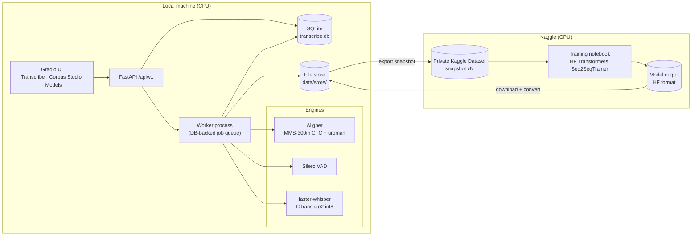

# Technical Requirements Document (TRD)

| | |
|---|---|
| Status | Draft v1 |
| Related | [01 PRD](01_PRD.md), [04 App Flow](04_APP_FLOW.md), [05 Backend Schema](05_BACKEND_SCHEMA.md) |

## 1. Architecture overview



Principles:

1. **Human text is authoritative.** Model output is stored as a *hypothesis* next to reviewer text and is never written over it.
2. **Immutability.** Source audio and transcripts are content-addressed (sha256) and never modified. Datasets are frozen snapshots, and model versions point to exactly one snapshot.
3. **One process model.** A single user on CPU needs no Redis or Celery. A worker process polls a jobs table in SQLite.
4. **Engines behind interfaces.** Aligner, VAD and ASR are swappable: a Protocol plus a registry, so the CTC comparison model or a larger Whisper plugs in without UI changes.

## 2. Model strategy

### 2.1 Why not "a proper English model + a proper Swahili model, blended"

This was the proposal in the requirements discussion. It does not work for Kenyan code-switching, for three reasons:

- **Routing needs per-word language ID before transcription.** A router (language ID → English or Swahili model) decides per segment. Switches happen mid-sentence and *mid-word* (*nimedownload*), below any practical language-ID granularity. Every routing error becomes a transcription error.
- **Monolingual models cannot output the other language.** A Swahili model spells English words in Swahili orthography (*daunlodi*), and an English model maps Swahili words onto English lookalikes. Merging hypotheses (ROVER-style) needs both hypotheses to contain the right word somewhere, and for intra-word switches neither does.
- **Cost and complexity.** It needs twice the compute on CPU, two fine-tuning tracks, and a merge heuristic with no training signal.

**What we do instead:** one multilingual pretrained model whose pretraining already covered both languages, fine-tuned on Kenyan code-switched speech. The blending happens in two places where it works:

- **The data mixture.** In-domain code-switched segments, plus public Kiswahili and public Kenyan-accented English, blended by sampling weights. This teaches the switch and keeps both monolingual abilities.
- **The tokenizer.** Whisper's byte-level BPE can emit any Latin string, so *nime* + *download* is just a token sequence. Nothing forces a single language per word.

### 2.2 Chosen models

| Role | Model | Why |
|---|---|---|
| **v1 production** | `openai/whisper-small` (244M), full fine-tune | Fits a Kaggle T4 in fp16. Readable output with casing and punctuation. Its 30 s window matches our segments. Mature CPU serving via faster-whisper int8. The fast iteration suits learning the process |
| v2 candidate | `openai/whisper-large-v3-turbo` (809M, 4-layer decoder), LoRA or 8-bit optimiser | Much stronger encoder with an inference cost close to small/medium. Adopted only if it beats v1 on the frozen dev set by a meaningful margin |
| Comparison (learning track) | `facebook/w2v-bert-2.0` + CTC head, optional KenLM trained on code-switched text | Contrasting paradigm: no hallucination, faithful verbatim output, character-level. Teaches CTC fine-tuning and LM fusion. Not production because it has no punctuation and weaker CPU tooling |
| Aligner (not trained) | MMS-300m forced-alignment model + uroman romaniser (via `ctc-forced-aligner`, or `torchaudio` MMS_FA pinned) | Language-agnostic: it aligns any romanised text, so mixed EN/SW transcripts align without choosing a language |
| VAD | Silero VAD | Robust on noise and music compared with the current energy threshold. Runs on CPU in ms per window |
| Legacy | Existing MFCC CNN-LSTM CTC/Seq2Seq | Kept under `legacy/` as an educational baseline only. Not deployable (see §2.4) |

Uncertainty on the aligner: torchaudio has been deprecating parts of its API. The aligner sits behind an interface and its dependency is pinned, so either backend can be used.

### 2.3 Whisper fine-tuning specifics

- **Language token:** fixed `<|sw|>` + `<|transcribe|>` + `<|notimestamps|>` for all training samples. Kenyan code-switching is predominantly Kiswahili-framed, and a fixed token removes the language-ID step at inference. **Experiment E3** compares `sw` vs `en` vs no language token on the dev set. This is a cheap and instructive ablation.
- **Non-speech examples:** about 5% of training samples are music/noise/silence windows with an empty target. This is the most direct fix for church and TV hallucination.
- **Data mixture (v1):** in-domain approved segments weight 1.0. Public Kiswahili (Common Voice sw, FLEURS sw_ke) weight about 0.3, to prevent forgetting and add speaker diversity. Kenyan-accented English (AfriSpeech-200 Kenyan subset) weight about 0.2. Licences must be checked before any commercial use (AfriSpeech is non-commercial).
- **Hyperparameters (starting point, T4 16 GB):** fp16, lr 1e-5, warmup 500, per-device batch 16 with gradient checkpointing, effective batch 32, 3–5k steps, evaluate every 500 steps on dev WER, keep the best checkpoint. SpecAugment is on (`mask_time_prob=0.05`).
- **Kaggle constraints:** a weekly GPU quota (~30 h) and a hard per-session limit, so we save checkpoints to `/kaggle/working` every 500 steps, the training script supports `resume_from_checkpoint`, and one session does one experiment.

### 2.4 Why the legacy model cannot be the product

- Hop 512 at 16 kHz gives 32 ms frames, and the three pooling layers make that 256 ms per CTC output frame. A 30 s segment has about 117 frames against about 400 target characters, and CTC requires frames ≥ target length. `CTCLoss(zero_infinity=True)` silently zeroes these losses.
- The tokenizer removes spaces, so output cannot be readable.
- It has no pretraining, and hundreds of hours of audio are needed before from-scratch ASR becomes competitive with a fine-tuned pretrained model.

If kept for learning, fix it with hop 160 (10 ms), 2× downsampling, a space token, and no SOS/EOS in CTC targets.

## 3. Segment length policy

(Answers "what chunk length?")

| Parameter | Value | Reason |
|---|---|---|
| Max segment | 30.0 s | Whisper's encoder window is exactly 30 s; anything longer is truncated |
| Target | 8–20 s | Enough context for the decoder; still fits CTC memory for the comparison model |
| Min segment | 1.5 s | Shorter segments carry little context and add label noise |
| Split points | Aligned inter-word gaps ≥ 300 ms; prefer the largest gap; prefer turn boundaries | Never cut a word; natural prosodic units |
| Padding | 100 ms on each side, clipped to the neighbouring word midpoint | Avoids clipped onsets without leaking neighbouring words |
| Speaker | A segment never spans a speaker turn change unless the turn is < 1.5 s | Clean targets; overlap is flagged |

At inference, Silero VAD speech regions are merged into windows of ≤ 30 s. Windows are cut at the longest silence and overlap by 0 s (VAD-cut, so no stitching is needed).

## 4. Corpus pipeline

```text
ingest → normalise audio → parse transcript → normalise text for alignment
→ long-form alignment → word timestamps + scores → segmentation
→ auto-flags + priority score → review → approve → dataset snapshot
```

### 4.1 Ingest

- ffmpeg decodes to a 16 kHz mono 16-bit WAV. The original file is kept byte-identical, stored at `data/store/originals/<sha256>.<ext>`.
- The transcript is parsed by the existing `docx_parser` / `pdf_parser`. The speaker regex and language hints (italic → `sw`, a convention that is verified per source) are reused.

### 4.2 Text normalisation for alignment (a separate text, never shown as the label)

- Remove bracketed annotations (`[unclear]`, `[laughs]`, `[crosstalk]`), but record their word positions for flags.
- Lowercase, and romanise with uroman (a no-op for Latin script, but it normalises diacritics and apostrophes).
- Digits become the aligner's `*` wildcard token, so numbers align without verbalisation.
- Keep a word-level index map `norm_word_i → source_char_span` so aligned timestamps map back onto the **original** transcript text, which becomes the segment label.

### 4.3 Long-form alignment

- CTC emissions are computed over the full audio in 30 s windows with 2 s overlap, then stitched.
- Alignment is turn-anchored: each transcript turn is aligned inside a search window around its expected position (moving anchor). This keeps the Viterbi trellis small (T × L per turn instead of per recording) and localises damage from non-verbatim passages.
- Output per word: `start_s`, `end_s`, and `score` (mean frame log-posterior, turned into a 0–1 confidence).
- A turn whose mean confidence is below θ (initially 0.5, tuned on the first reviewed recording) is flagged `low_alignment`. That is the usual signature of a non-verbatim or missing passage.

### 4.4 Priority score for the review queue

```text
priority = 0.5·(1 − alignment_conf) + 0.2·has_unclear_marker + 0.1·overlap_marker
         + 0.2·model_disagreement (WER(aligned_text, model_hypothesis), once a model exists)
```

The review queue sorts by `priority` descending. Segments with high confidence and low disagreement can be **batch-approved after spot-checking** a random 10%, controlled by a setting and off by default.

### 4.5 Recordings without transcripts

Silero VAD splits them into ≤ 30 s chunks, the current production model pre-fills the text (stored as a hypothesis, with the reviewer text starting from a copy), and they go into the same review UI.

## 5. Inference pipeline

1. Decode with ffmpeg → 16 kHz mono float32.
2. Silero VAD (threshold 0.5, min speech 250 ms, min silence 400 ms) gives speech regions.
3. Merge regions into windows of ≤ 30 s.
4. Run faster-whisper on each window: `language="sw"`, `task="transcribe"`, `beam_size=5`, `condition_on_previous_text=False`, `word_timestamps=True`, `vad_filter=False` (VAD has already been applied).
5. Guards: drop segments with `no_speech_prob > 0.6` and `avg_logprob < −1.0`. Drop segments with compression ratio > 2.4 (repetition loops). Collapse a 3-gram repeated more than 3 times.
6. Post-processing: timestamps are offset back to absolute time, and segments are persisted as `job_segments`.
7. Export renderers: TXT, SRT, VTT, JSON, DOCX.

Batching: windows run sequentially, with `cpu_threads = physical cores` and `compute_type="int8"`. Progress = processed audio seconds / total speech seconds.

## 6. Service design

### 6.1 Processes

| Process | Command | Responsibility |
|---|---|---|
| `api` | `python -m transcribe.api` | FastAPI + Gradio mounted at `/`. Handles CRUD and enqueues jobs |
| `worker` | `python -m transcribe.worker` | Polls `jobs` (`status='queued'`), runs alignment, transcription, evaluation and export, and heartbeats |

Both processes share SQLite in WAL mode. A job is claimed with `UPDATE jobs SET status='running', worker_id=? WHERE id=? AND status='queued'`. A stale heartbeat (> 2 min) puts the job back in the queue.

### 6.2 REST API (`/api/v1`)

| Method | Path | Purpose |
|---|---|---|
| POST | `/recordings` | Multipart upload of audio (+ transcript), domain, consent_scope |
| GET | `/recordings`, `/recordings/{id}` | List and detail, with review progress |
| POST | `/recordings/{id}/align` | Enqueue alignment + segmentation |
| GET | `/review/queue?recording_id=&limit=` | Next segments by priority |
| GET | `/segments/{id}` | Segment + current revision + hypotheses + audio URL |
| POST | `/segments/{id}/revisions` | Create a new revision (text, bounds, flags, spans, status). Rejected with 409 on version conflict |
| POST | `/segments/{id}/hypothesis` | Run the model on the segment (stored as a hypothesis only) |
| GET | `/segments/{id}/audio` | WAV slice (rendered on demand from the recording, cached) |
| POST | `/datasets` | Build a snapshot from a filter spec + split spec |
| POST | `/datasets/{id}/export` | Write the HF-format package for Kaggle |
| POST | `/models` | Register a model (upload or path), enqueue CT2 conversion |
| POST | `/models/{id}/promote` | Set the production model |
| POST | `/evaluations` | Enqueue evaluation of a model on a dataset split |
| GET | `/evaluations/{id}` | Metrics + per-segment results |
| POST | `/transcriptions` | Upload a file for transcription (enqueue a job) |
| GET | `/transcriptions/{id}` | Status, progress, segments |
| PATCH | `/transcriptions/{id}/segments/{seg_id}` | Save an edit |
| GET | `/transcriptions/{id}/export?format=srt` | Download |
| POST | `/transcriptions/{id}/promote` | Copy edited segments into the corpus (consent-checked) |

Optimistic concurrency: every revision POST carries `base_revision_id`. A mismatch returns 409, so a second browser tab cannot overwrite silently.

### 6.3 Package layout (target)

```text
src/transcribe/
  api/            # FastAPI app, routers, schemas (pydantic)
  worker/         # job loop, handlers
  db/             # SQLAlchemy models, session, Alembic migrations
  corpus/
    ingest.py  parsers/ (docx_parser.py, pdf_parser.py — moved from preprocessing)
    textnorm.py  align.py  segment.py  priority.py
  inference/
    vad.py  engine.py (Protocol + faster-whisper impl)  longform.py  guards.py  export/
  datasets/       # snapshot build, grouped split, HF export
  finetune/       # whisper_train.py, w2vbert_ctc_train.py (run inside Kaggle)
  evaluation/     # normalizer.py, metrics.py (WER/CER/switch-point/hallucination), report.py
  ui/             # Gradio Blocks: transcribe.py, review.py, models.py, theme.py
  legacy/         # ctc_model.py, seq2seq.py, trainer.py, data/ (unchanged behaviour)
notebooks/kaggle/ # thin notebooks calling transcribe.finetune.*
tests/
```

The package imports as `transcribe` (installed via `pip install -e .`). The `sys.path` / `src.` import hack is removed.

## 7. Dependencies

| Group | Packages |
|---|---|
| core | fastapi, uvicorn, sqlalchemy≥2, alembic, pydantic≥2, python-multipart, soundfile, numpy, ffmpeg (system) |
| corpus | python-docx, pypdf, ctc-forced-aligner (or torchaudio pinned), uroman, torch (CPU) |
| inference | faster-whisper, silero-vad (onnx), python-docx (export) |
| ui | gradio≥4 |
| eval | jiwer |
| finetune (Kaggle only) | transformers, datasets, accelerate, evaluate, peft (v2), bitsandbytes (v2) |
| legacy | librosa, scikit-learn, editdistance, nltk |

Requirements are split into `requirements/{core,corpus,inference,ui,finetune,legacy}.txt`. Versions are pinned with upper bounds, following the current practice.

## 8. Evaluation

### 8.1 Splits (answers "how should we split?")

- **Group by recording, never by chunk.** Chunks from one recording share speaker, microphone, room and topic, so a random chunk split leaks all of them and inflates results.
- If a speaker appears in several recordings (the same interviewer), group by speaker cluster: all recordings of that speaker go to the same split, or that speaker is held out explicitly.
- **Test ≈ 10% of recordings, frozen forever** (for comparability across model versions), stratified so it contains clean and noisy, low and high code-switch density, and each domain available. **Dev ≈ 10%**, used for checkpoint selection and ablations. Train is the rest.
- New recordings go to train by default. New *domains* (TV, church) first get a held-out evaluation set of ≥ 1 h before any of their data goes into train.
- Also keep FLEURS `sw_ke` test as a forgetting check. Test-set segments are never used for anything except final reports.

### 8.2 Normaliser (versioned, `normalizer_version` stored with each evaluation)

Lowercase. Strip punctuation except intra-word apostrophes. Remove hyphens (so *nime-download* ≡ *nimedownload*). Collapse whitespace. Remove bracketed annotations. Map a small table of spelling variants (e.g. *ok/okay*) from the style guide. Leave digits as-is (the style guide governs this).

### 8.3 Metrics

| Metric | Definition |
|---|---|
| WER / CER | jiwer on normalised text, micro-averaged (total errors / total reference words) |
| Per-language WER | Using reference language spans: errors attributed to `en`, `sw` and `mixed` reference words via the jiwer alignment |
| Switch-point error rate | Over reference words adjacent to a language change (plus all `mixed` words): the fraction misrecognised. This directly measures the code-switching capability |
| Hallucination rate | Words emitted per minute on reference non-speech segments (the non-speech test subset) |
| RTF | Wall time / audio duration on the reference CPU |

Reports are broken down by domain and by flag (clean / noisy / overlap).

## 9. Security and privacy

- The app binds to `127.0.0.1` by default. Exposing it on a network requires setting `TRANSCRIBE_AUTH_TOKEN` (a bearer token middleware) in v1.
- `consent_scope ∈ {training, eval_only, transcription_only}` on every recording is enforced in the dataset builder (training split only from `training`), in the Kaggle export, and in "promote to corpus".
- Kaggle datasets are created private. The export package contains only audio slices and text, never names from the transcript header or file paths.
- No demographic or ethnicity fields are stored. Speaker labels are opaque (`S1`, `interviewer`).
- Uploaded transcription files are deleted after N days (configurable) unless promoted.

## 10. Testing strategy

| Level | What |
|---|---|
| Unit | Text normaliser, segmenter on synthetic word timings, priority, grouped split (asserts no recording in two splits), metric functions (hand-computed cases incl. switch points), guards |
| Integration | A 60 s synthetic fixture (TTS or public-domain clip + transcript) goes through align → segment → dataset export, all on CPU in < 2 min |
| API | FastAPI TestClient: revision conflict (409), consent enforcement, job lifecycle |
| Model | The Kaggle notebook prints dev WER. `evaluate` reproduces the same WER locally within ±0.5 absolute |
| CI | GitHub Actions: ruff + pytest (unit + integration with a tiny aligner mock) on Ubuntu, Python 3.10 |
