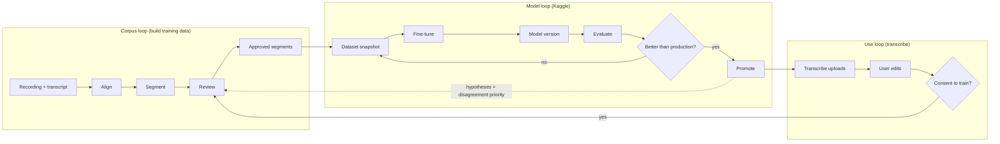
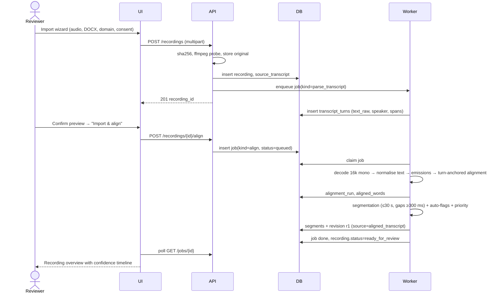
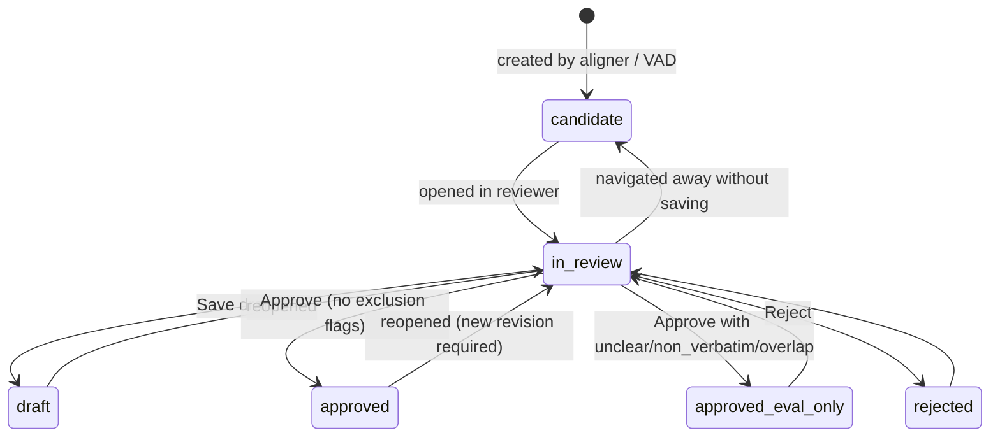
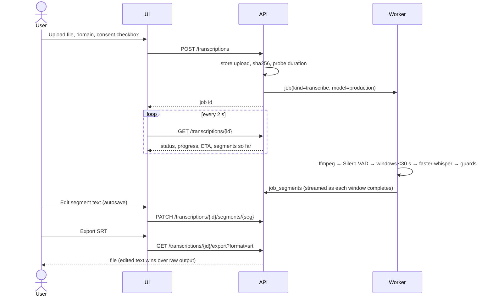

# Application Flow

| | |
|---|---|
| Status | Draft v1 |
| Related | [03 UI/UX](03_UI_UX_DESIGN.md), [05 Backend Schema](05_BACKEND_SCHEMA.md) |

The system has two loops that meet at the corpus:



## 1. Flow A: Import and align a transcribed recording



Failure branches:

| Condition | Result |
|---|---|
| Duplicate sha256 | 409 with a link to the existing recording |
| Transcript parses to 0 turns | Wizard step 3 shows an error; the user can import without a transcript (Flow B) |
| Alignment mean confidence < 0.3 for the whole recording | Job succeeds but the recording is flagged `alignment_suspect` (wrong transcript attached?); the overview shows a warning and offers "Re-align with other transcript" or "Fall back to VAD" |
| Worker crash | Heartbeat expires and the job is re-queued (max 3 attempts, then `failed`) |

## 2. Flow B: Import a recording without a transcript

`POST /recordings` without a transcript enqueues `vad_segment`: Silero VAD produces windows of ≤ 30 s, which become segments with an empty r1. If a production model exists, `hypothesize` jobs create hypotheses and r2 (`source=model_hypothesis`, clearly labelled). The recording then enters the same review queue. Priority comes from model confidence instead of alignment confidence.

## 3. Flow C: Review a segment



Each transition that changes content creates a new `segment_revisions` row. `segments.current_revision_id` moves forward, and old revisions are never deleted.

Sequence for "Approve & next":

1. The UI sends `POST /segments/{id}/revisions {base_revision_id, text, start_s, end_s, flags, spans, speaker_label, status:"approved"}`.
2. The API checks `base_revision_id == segments.current_revision_id`. If it differs → 409.
3. In one transaction, the API inserts the revision, updates the segment (status, current_revision_id, bounds), and invalidates the cached audio slice if the bounds changed.
4. The API returns the next segment from `GET /review/queue`: ordered by `priority DESC, ordinal ASC` and skipping `approved|rejected`.
5. The UI loads it and autoplays.

"Run model" (R): `POST /segments/{id}/hypothesis` runs inline if the model is loaded (< 3 s on CPU for a ≤ 30 s clip with whisper-small int8), otherwise it enqueues a job. The result is stored in `hypotheses`. The editor text is **unchanged**. The diff and WER are displayed, and `segments.priority` is recomputed with model disagreement.

## 4. Flow D: Build a dataset snapshot and train on Kaggle

```mermaid
sequenceDiagram
  actor D as Developer
  participant UI
  participant API
  participant W as Worker
  participant K as Kaggle
  D->>UI: Datasets → filter + split preview
  UI->>API: POST /datasets {filter_spec, split_spec}
  API->>API: select approved revisions (consent=training for train/dev)
  API->>API: grouped split by recording; assert no leakage; attach frozen test set
  API-->>UI: snapshot kct-ds-v3 (frozen, sha256)
  D->>UI: Export for Kaggle
  UI->>API: POST /datasets/{id}/export
  W->>W: slice audio → data/exports/kct-ds-v3/{train,dev,test}/*.wav + metadata.jsonl + dataset_card.md
  D->>K: kaggle datasets version -p data/exports/kct-ds-v3 (private)
  D->>K: Run notebook finetune_whisper.ipynb (dataset=kct-ds-v3, config=whisper-small.yaml)
  K-->>D: output: model/, trainer_state.json, eval_dev.json, run_manifest.json
  D->>UI: Models → Register (upload output zip or path)
  UI->>API: POST /models
  W->>W: verify dataset hash in run_manifest == snapshot hash
  W->>W: ct2-transformers-converter --quantization int8
  W->>API: enqueue evaluation on dev + test
  UI-->>D: Registry row with dev/test WER
```

Rules:

- The test split is attached from the frozen `test_v1` definition and is never re-sampled.
- The worker refuses to register a model whose `run_manifest.dataset_sha256` is unknown. This prevents mystery models.
- The notebook is thin: `!pip install -e /kaggle/input/transcribe-src` followed by `python -m transcribe.finetune.whisper_train --config ...`, so the training code is version-controlled in this repo.

## 5. Flow E: Evaluate and promote

1. `POST /evaluations {model_id, dataset_id, split}` enqueues a job.
2. The worker transcribes each segment with the model (CT2 int8, the same path as production), normalises, computes metrics, and writes `eval_runs` + `eval_results`.
3. The report screen shows metrics and the worst segments. "Send to review" pushes those segments to the top of the review queue (priority = 1.0). Worst segments are often label errors, not model errors.
4. Promotion gate (enforced by the API; override needs `force=true` + a note): the candidate's **test WER ≤ production test WER**, **hallucination rate is not worse by more than 10%**, and **RTF ≤ 0.5**.
5. `POST /models/{id}/promote` sets `status=production`, retires the previous one, and the Transcribe service reloads the model.

## 6. Flow F: Transcribe a file



Optional "Promote edits to corpus" (only if consent was given at upload):

- Each edited job segment becomes a corpus `segment` (origin=`inference_correction`) with r1 = the model output (`source=model_hypothesis`) and r2 = the user's edit (`source=human`, status `candidate`).
- These enter the review queue at high priority. They are the most valuable training examples, because they are exactly where the model failed.
- Unedited segments are **not** promoted: unverified model output must not become training data.

## 7. Flow G: Active learning cycle (v2)

1. Once a week, run the production model over all un-reviewed segments (recordings without transcripts, promoted jobs).
2. Priority = model uncertainty (mean token log-prob, low-confidence word count) plus disagreement with the aligned text where it exists.
3. Review the top-N segments.
4. Build a snapshot, fine-tune, evaluate, and apply the promotion gate.
5. Track learning curves: test WER vs. hours of approved data per snapshot. This data answers the question "how much more data do we need?".

## 8. Error-handling summary

| Where | Error | Behaviour |
|---|---|---|
| Upload | Unsupported codec / corrupt | 422 with the ffmpeg message; nothing is stored |
| Any job | Exception | `status=failed`, `error` stored, retry button; attempts ≤ 3 |
| Review save | Stale base revision | 409, conflict banner, nothing lost |
| Model load | CT2 files missing | The model is marked `broken`; Transcribe falls back to the previous production model with a banner |
| Kaggle registration | Dataset hash mismatch | Registration rejected with the expected vs. found hash |
| Disk full | Write failure | The job fails cleanly; the UI shows the storage usage panel |
