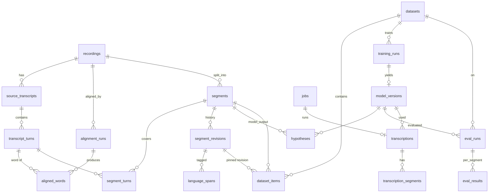

# Backend Schema

| | |
|---|---|
| Status | Draft v1 |
| Database | SQLite 3 (WAL mode) via SQLAlchemy 2 + Alembic. Portable to PostgreSQL without schema changes (no SQLite-only types; JSON is stored as TEXT with CHECK `json_valid`, which becomes JSONB on Postgres) |
| Related | [02 TRD](02_TRD.md), [04 App Flow](04_APP_FLOW.md) |

## 1. Entity overview



Conventions:

- IDs are ULIDs stored as `TEXT` (sortable by creation time and safe to generate in either process).
- Timestamps are ISO-8601 UTC strings in `TEXT` (`created_at`, `updated_at`).
- Audio times are `REAL` seconds relative to the recording start.
- Enumerations are `TEXT` columns with `CHECK` constraints; in SQLAlchemy they map to `Enum(..., native_enum=False)`.

## 2. DDL

```sql
PRAGMA foreign_keys = ON;
PRAGMA journal_mode = WAL;

-- ───────────────────────── Sources ─────────────────────────
CREATE TABLE recordings (
  id              TEXT PRIMARY KEY,
  title           TEXT NOT NULL,
  original_path   TEXT NOT NULL,            -- data/store/originals/<sha256>.<ext>
  normalized_path TEXT,                     -- data/store/audio16k/<sha256>.wav
  sha256          TEXT NOT NULL UNIQUE,
  duration_s      REAL NOT NULL,
  domain          TEXT NOT NULL DEFAULT 'interview'
                  CHECK (domain IN ('interview','tv','radio','church','meeting','other')),
  consent_scope   TEXT NOT NULL
                  CHECK (consent_scope IN ('training','eval_only','transcription_only')),
  recorded_on     TEXT,
  region          TEXT,                     -- free text, optional; never ethnicity
  status          TEXT NOT NULL DEFAULT 'imported'
                  CHECK (status IN ('imported','aligning','ready_for_review',
                                    'alignment_suspect','reviewed','archived')),
  notes           TEXT,
  created_at      TEXT NOT NULL,
  updated_at      TEXT NOT NULL
);

CREATE TABLE source_transcripts (
  id              TEXT PRIMARY KEY,
  recording_id    TEXT NOT NULL REFERENCES recordings(id) ON DELETE CASCADE,
  path            TEXT NOT NULL,
  format          TEXT NOT NULL CHECK (format IN ('docx','pdf','txt')),
  sha256          TEXT NOT NULL,
  parser          TEXT NOT NULL,            -- 'python-docx' | 'pypdf'
  parser_version  TEXT NOT NULL,
  italic_means    TEXT CHECK (italic_means IN ('sw','en','none')) DEFAULT 'sw',
  created_at      TEXT NOT NULL,
  UNIQUE (recording_id, sha256)
);

CREATE TABLE transcript_turns (
  id              TEXT PRIMARY KEY,
  source_transcript_id TEXT NOT NULL REFERENCES source_transcripts(id) ON DELETE CASCADE,
  ordinal         INTEGER NOT NULL,
  speaker_label   TEXT,                     -- 'I', 'R', 'P1' as written
  speaker_role    TEXT CHECK (speaker_role IN ('interviewer','respondent','host',
                                               'preacher','audience','other')),
  text_raw        TEXT NOT NULL,            -- exactly as in the source (label source)
  text_align      TEXT NOT NULL,            -- normalised text used by the aligner
  word_map        TEXT NOT NULL CHECK (json_valid(word_map)),
                  -- [[align_word_idx, raw_char_start, raw_char_end], ...]
  spans           TEXT NOT NULL DEFAULT '[]' CHECK (json_valid(spans)),
                  -- language hints from formatting: [{start,end,lang}]
  annotations     TEXT NOT NULL DEFAULT '[]' CHECK (json_valid(annotations)),
                  -- [{"marker":"[unclear]","char":123}]
  UNIQUE (source_transcript_id, ordinal)
);

-- ───────────────────────── Alignment ─────────────────────────
CREATE TABLE alignment_runs (
  id              TEXT PRIMARY KEY,
  recording_id    TEXT NOT NULL REFERENCES recordings(id) ON DELETE CASCADE,
  source_transcript_id TEXT NOT NULL REFERENCES source_transcripts(id),
  aligner         TEXT NOT NULL,            -- 'ctc-forced-aligner'
  aligner_version TEXT NOT NULL,
  params          TEXT NOT NULL CHECK (json_valid(params)),
  mean_confidence REAL,
  status          TEXT NOT NULL CHECK (status IN ('running','done','failed')),
  created_at      TEXT NOT NULL,
  finished_at     TEXT
);

CREATE TABLE aligned_words (
  alignment_run_id TEXT NOT NULL REFERENCES alignment_runs(id) ON DELETE CASCADE,
  turn_id         TEXT NOT NULL REFERENCES transcript_turns(id),
  word_idx        INTEGER NOT NULL,         -- index within turn's text_align
  word            TEXT NOT NULL,
  start_s         REAL NOT NULL,
  end_s           REAL NOT NULL,
  score           REAL NOT NULL,            -- 0..1
  PRIMARY KEY (alignment_run_id, turn_id, word_idx)
);

-- ───────────────────────── Segments & review ─────────────────────────
CREATE TABLE segments (
  id              TEXT PRIMARY KEY,
  recording_id    TEXT NOT NULL REFERENCES recordings(id) ON DELETE CASCADE,
  alignment_run_id TEXT REFERENCES alignment_runs(id),
  origin          TEXT NOT NULL CHECK (origin IN ('alignment','vad','inference_correction')),
  ordinal         INTEGER NOT NULL,
  start_s         REAL NOT NULL,            -- mirrors current revision
  end_s           REAL NOT NULL,
  speaker_label   TEXT,
  status          TEXT NOT NULL DEFAULT 'candidate'
                  CHECK (status IN ('candidate','in_review','draft','approved',
                                    'approved_eval_only','rejected')),
  current_revision_id TEXT,                 -- FK added below (circular)
  alignment_conf  REAL,
  auto_flags      TEXT NOT NULL DEFAULT '[]' CHECK (json_valid(auto_flags)),
                  -- ['low_alignment','unclear_marker','overlap_marker',...]
  priority        REAL NOT NULL DEFAULT 0,
  audio_cache_path TEXT,                    -- rendered slice; invalidated on bound change
  created_at      TEXT NOT NULL,
  updated_at      TEXT NOT NULL,
  CHECK (end_s > start_s),
  UNIQUE (recording_id, ordinal)
);
CREATE INDEX ix_segments_queue ON segments (recording_id, status, priority DESC);

CREATE TABLE segment_turns (
  segment_id      TEXT NOT NULL REFERENCES segments(id) ON DELETE CASCADE,
  turn_id         TEXT NOT NULL REFERENCES transcript_turns(id),
  PRIMARY KEY (segment_id, turn_id)
);

CREATE TABLE segment_revisions (          -- append-only
  id              TEXT PRIMARY KEY,
  segment_id      TEXT NOT NULL REFERENCES segments(id) ON DELETE CASCADE,
  revision_no     INTEGER NOT NULL,
  parent_revision_id TEXT REFERENCES segment_revisions(id),
  text            TEXT NOT NULL,
  start_s         REAL NOT NULL,
  end_s           REAL NOT NULL,
  speaker_label   TEXT,
  flags           TEXT NOT NULL DEFAULT '{}' CHECK (json_valid(flags)),
                  -- {"unclear":false,"overlap":false,"noisy":false,
                  --  "music":false,"non_verbatim":false}
  status          TEXT NOT NULL,            -- status set by this revision
  source          TEXT NOT NULL CHECK (source IN ('aligned_transcript','vad_empty',
                                                  'model_hypothesis','human')),
  hypothesis_id   TEXT REFERENCES hypotheses(id),  -- when source=model_hypothesis
  author          TEXT NOT NULL,            -- 'aligner', 'system', or reviewer handle
  created_at      TEXT NOT NULL,
  UNIQUE (segment_id, revision_no)
);

CREATE TABLE language_spans (
  revision_id     TEXT NOT NULL REFERENCES segment_revisions(id) ON DELETE CASCADE,
  char_start      INTEGER NOT NULL,
  char_end        INTEGER NOT NULL,
  lang            TEXT NOT NULL CHECK (lang IN ('en','sw','mixed','luo','other','unclear')),
  PRIMARY KEY (revision_id, char_start),
  CHECK (char_end > char_start)
);

CREATE TABLE hypotheses (
  id              TEXT PRIMARY KEY,
  segment_id      TEXT NOT NULL REFERENCES segments(id) ON DELETE CASCADE,
  model_version_id TEXT NOT NULL REFERENCES model_versions(id),
  text            TEXT NOT NULL,
  words           TEXT CHECK (json_valid(words)),   -- [{w,start,end,p}]
  avg_logprob     REAL,
  no_speech_prob  REAL,
  wer_vs_current  REAL,                     -- vs revision current at creation time
  created_at      TEXT NOT NULL
);

-- ───────────────────────── Datasets, training, models ─────────────────────────
CREATE TABLE datasets (
  id              TEXT PRIMARY KEY,
  name            TEXT NOT NULL UNIQUE,     -- 'kct-ds-v3'
  filter_spec     TEXT NOT NULL CHECK (json_valid(filter_spec)),
  split_spec      TEXT NOT NULL CHECK (json_valid(split_spec)),
  test_set_name   TEXT NOT NULL,            -- 'test_v1' (frozen definition)
  normalizer_version TEXT NOT NULL,
  sha256          TEXT,                     -- hash of sorted (segment_id, revision_id, split)
  frozen          INTEGER NOT NULL DEFAULT 0 CHECK (frozen IN (0,1)),
  export_path     TEXT,
  stats           TEXT CHECK (json_valid(stats)),   -- hours/segments/recordings per split
  created_at      TEXT NOT NULL
);

CREATE TABLE dataset_items (
  dataset_id      TEXT NOT NULL REFERENCES datasets(id) ON DELETE CASCADE,
  segment_id      TEXT NOT NULL REFERENCES segments(id),
  revision_id     TEXT NOT NULL REFERENCES segment_revisions(id),  -- pinned text
  split           TEXT NOT NULL CHECK (split IN ('train','dev','test')),
  PRIMARY KEY (dataset_id, segment_id)
);
CREATE INDEX ix_dataset_items_split ON dataset_items (dataset_id, split);

CREATE TABLE test_set_recordings (         -- frozen test membership, by recording
  test_set_name   TEXT NOT NULL,
  recording_id    TEXT NOT NULL REFERENCES recordings(id),
  PRIMARY KEY (test_set_name, recording_id)
);

CREATE TABLE training_runs (
  id              TEXT PRIMARY KEY,
  dataset_id      TEXT NOT NULL REFERENCES datasets(id),
  base_model      TEXT NOT NULL,            -- 'openai/whisper-small'
  platform        TEXT NOT NULL CHECK (platform IN ('kaggle','local','other')),
  config          TEXT NOT NULL CHECK (json_valid(config)),
  code_commit     TEXT,                     -- git sha of transcribe package used
  notebook_ref    TEXT,                     -- kaggle notebook slug + version
  dev_metrics     TEXT CHECK (json_valid(dev_metrics)),
  started_at      TEXT,
  finished_at     TEXT,
  status          TEXT NOT NULL CHECK (status IN ('registered','failed'))
);

CREATE TABLE model_versions (
  id              TEXT PRIMARY KEY,
  name            TEXT NOT NULL UNIQUE,     -- 'whisper-small-kct-v1'
  family          TEXT NOT NULL CHECK (family IN ('whisper','w2vbert_ctc','legacy_ctc')),
  base_model      TEXT NOT NULL,
  training_run_id TEXT REFERENCES training_runs(id),  -- NULL for zero-shot baselines
  hf_path         TEXT NOT NULL,            -- data/store/models/<name>/hf
  ct2_path        TEXT,                     -- data/store/models/<name>/ct2-int8
  decode_params   TEXT NOT NULL CHECK (json_valid(decode_params)),
  status          TEXT NOT NULL DEFAULT 'candidate'
                  CHECK (status IN ('converting','candidate','production','retired','broken')),
  promoted_at     TEXT,
  promotion_note  TEXT,
  created_at      TEXT NOT NULL
);
CREATE UNIQUE INDEX ux_one_production ON model_versions (status) WHERE status = 'production';

CREATE TABLE eval_runs (
  id              TEXT PRIMARY KEY,
  model_version_id TEXT NOT NULL REFERENCES model_versions(id),
  dataset_id      TEXT NOT NULL REFERENCES datasets(id),
  split           TEXT NOT NULL CHECK (split IN ('dev','test','external')),
  normalizer_version TEXT NOT NULL,
  metrics         TEXT CHECK (json_valid(metrics)),
                  -- {"wer":..,"cer":..,"wer_en":..,"wer_sw":..,"wer_mixed":..,
                  --  "switch_point_er":..,"halluc_per_min":..,"rtf":..,
                  --  "by_domain":{..},"by_flag":{..}}
  status          TEXT NOT NULL CHECK (status IN ('queued','running','done','failed')),
  created_at      TEXT NOT NULL
);

CREATE TABLE eval_results (
  eval_run_id     TEXT NOT NULL REFERENCES eval_runs(id) ON DELETE CASCADE,
  segment_id      TEXT NOT NULL REFERENCES segments(id),
  reference       TEXT NOT NULL,
  hypothesis      TEXT NOT NULL,
  wer             REAL NOT NULL,
  cer             REAL NOT NULL,
  n_ref_words     INTEGER NOT NULL,
  n_switch_points INTEGER NOT NULL,
  n_switch_errors INTEGER NOT NULL,
  PRIMARY KEY (eval_run_id, segment_id)
);

-- ───────────────────────── Jobs & transcription ─────────────────────────
CREATE TABLE jobs (
  id              TEXT PRIMARY KEY,
  kind            TEXT NOT NULL CHECK (kind IN ('parse_transcript','align','vad_segment',
                        'hypothesize','build_dataset','export_dataset','register_model',
                        'convert_model','evaluate','transcribe','export_transcription')),
  payload         TEXT NOT NULL CHECK (json_valid(payload)),
  status          TEXT NOT NULL DEFAULT 'queued'
                  CHECK (status IN ('queued','running','done','failed','cancelled')),
  progress        REAL NOT NULL DEFAULT 0,  -- 0..1
  attempts        INTEGER NOT NULL DEFAULT 0,
  worker_id       TEXT,
  heartbeat_at    TEXT,
  error           TEXT,
  result          TEXT CHECK (json_valid(result)),
  created_at      TEXT NOT NULL,
  started_at      TEXT,
  finished_at     TEXT
);
CREATE INDEX ix_jobs_queue ON jobs (status, created_at);

CREATE TABLE transcriptions (
  id              TEXT PRIMARY KEY,
  job_id          TEXT NOT NULL REFERENCES jobs(id),
  title           TEXT NOT NULL,
  input_path      TEXT NOT NULL,
  sha256          TEXT NOT NULL,
  duration_s      REAL,
  domain          TEXT NOT NULL DEFAULT 'other',
  consent_to_train INTEGER NOT NULL DEFAULT 0 CHECK (consent_to_train IN (0,1)),
  model_version_id TEXT NOT NULL REFERENCES model_versions(id),
  rtf             REAL,
  expires_at      TEXT,                     -- retention; NULL once promoted
  created_at      TEXT NOT NULL
);

CREATE TABLE transcription_segments (
  id              TEXT PRIMARY KEY,
  transcription_id TEXT NOT NULL REFERENCES transcriptions(id) ON DELETE CASCADE,
  ordinal         INTEGER NOT NULL,
  start_s         REAL NOT NULL,
  end_s           REAL NOT NULL,
  text            TEXT NOT NULL,            -- raw model output (immutable)
  words           TEXT CHECK (json_valid(words)),
  avg_logprob     REAL,
  no_speech_prob  REAL,
  edited_text     TEXT,                     -- user edit; exports prefer this
  edited_at       TEXT,
  promoted_segment_id TEXT REFERENCES segments(id),
  UNIQUE (transcription_id, ordinal)
);
```

The circular foreign key `segments.current_revision_id → segment_revisions.id` is created by Alembic with `use_alter=True`. SQLite does not enforce ALTER-added foreign keys, so the invariant is checked in the service layer and by a test.

## 3. Key invariants (enforced in the service layer and tested)

1. `segment_revisions` is append-only: no UPDATE or DELETE except by cascade when a recording is deleted.
2. `segments.{start_s,end_s,status,speaker_label}` always equal those of `current_revision_id`.
3. A `hypotheses` row never changes `segment_revisions`. Only an explicit reviewer action creates a revision with `source='model_hypothesis'`.
4. `datasets.frozen = 1` means the dataset has no inserts, updates or deletes on `dataset_items`, and `sha256` is set.
5. The train/dev splits contain only recordings with `consent_scope='training'`. The test split may contain `training` or `eval_only`.
6. No `recording_id` appears in more than one split in a dataset, and no recording in `test_set_recordings` appears in train or dev of any dataset.
7. Items with status `approved_eval_only`, or with flags `unclear`, `non_verbatim` or `overlap`, never go to train (they may go to test, tagged by flag).
8. At most one `model_versions` row has `status='production'` (partial unique index).

## 4. File store layout

```text
data/
  transcribe.db
  store/
    originals/<sha256>.<ext>          # byte-identical uploads (never modified)
    transcripts/<sha256>.<docx|pdf>
    audio16k/<sha256>.wav             # normalised full recordings
    slices/<segment_id>_<rev>.wav     # cache; safe to delete
    models/<name>/{hf/, ct2-int8/, run_manifest.json}
    uploads/<transcription_id>.<ext>  # retention-managed
  exports/
    <dataset_name>/
      dataset_card.md
      metadata.jsonl                  # see §5
      train/<segment_id>.wav
      dev/<segment_id>.wav
      test/<segment_id>.wav
```

The existing `data/projects/<name>/{transcript.json,audio.json,chunks/}` manifests are migrated once by `python -m transcribe.db.migrate_json` (see the Implementation Plan, Phase 0).

## 5. Export format (Kaggle / Hugging Face)

`metadata.jsonl` has one line per item and follows the `audiofolder` convention, so the export loads with `load_dataset("audiofolder", data_dir=...)`:

```json
{"file_name": "train/01J8Z...wav", "split": "train", "text": "Sasa mimi nilikuwa nimeapply hiyo job lakini they never called back",
 "segment_id": "01J8Z...", "revision_id": "01J90...", "recording_group": "r_7f3a",
 "domain": "interview", "duration": 11.55, "speaker_role": "respondent",
 "flags": [], "lang_spans": [[0, 26, "sw"], [27, 36, "mixed"], [37, 40, "sw"], [41, 70, "en"]]}
```

- `recording_group` is a salted hash of `recording_id`, so no titles or file names leave the machine.
- `dataset_card.md` records the dataset name, sha256, normaliser version, per-split hours, filter spec, and the consent statement.

The Kaggle notebook writes `run_manifest.json`:

```json
{"dataset_name": "kct-ds-v3", "dataset_sha256": "…", "base_model": "openai/whisper-small",
 "code_commit": "…", "config": {…}, "best_step": 3500, "dev_wer": 0.231,
 "started_at": "…", "finished_at": "…", "kaggle_notebook": "user/finetune-whisper@v7"}
```

## 6. Pydantic API schemas (core)

```python
class RevisionIn(BaseModel):
    base_revision_id: str
    text: str
    start_s: float
    end_s: float
    speaker_label: str | None = None
    flags: dict[Literal["unclear","overlap","noisy","music","non_verbatim"], bool] = {}
    spans: list[tuple[int, int, Literal["en","sw","mixed","luo","other","unclear"]]] = []
    status: Literal["draft","approved","approved_eval_only","rejected"]

class SegmentOut(BaseModel):
    id: str; recording_id: str; ordinal: int
    start_s: float; end_s: float; status: str; priority: float
    auto_flags: list[str]; alignment_conf: float | None
    current_revision: RevisionOut
    hypotheses: list[HypothesisOut]
    audio_url: str

class DatasetIn(BaseModel):
    name: str
    filter_spec: FilterSpec     # recordings, domains, statuses, exclude_flags, roles, min/max duration
    split_spec: SplitSpec       # dev_fraction, seed, group_by: Literal["recording","speaker_cluster"]
    test_set_name: str = "test_v1"
```

## 7. Migration from the current JSON manifests

| Current (`audio.json` / `transcript.json`) | New |
|---|---|
| `recording_id`, `source_audio` | `recordings` (sha256 computed, original copied to store) |
| `transcript_turns[]` | `source_transcripts` + `transcript_turns` (`text` → `text_raw`, spans kept) |
| `segments[]` with `status=candidate` and empty transcript | Dropped. They are VAD candidates that were never reviewed, and re-running alignment gives better segments |
| `segments[]` with `status=approved` | `segments` (origin=`vad`) + revision r1 (`source=human`, status approved) |
| `asr_hypothesis`, `wer` | Ignored (no model existed) |
