# Implementation Plan

| | |
|---|---|
| Status | Draft v1 |
| Team | 1 developer/reviewer. CPU laptop + Kaggle GPU |
| Related | All previous docs. Each task ID maps to PRD/TRD requirement IDs where applicable |

The phases are ordered so that each one produces something usable and measurable. Estimates are working days for one person. Review hours for labelling are listed separately because they run in parallel with coding.

```mermaid
gantt
  dateFormat  X
  axisFormat  %d
  section Build
  P0 Foundations            :p0, 0, 5d
  P1 Alignment pipeline     :p1, after p0, 7d
  P2 Review UI v2           :p2, after p1, 6d
  P3 Datasets + baselines   :p3, after p2, 5d
  P4 Fine-tune v1 (Kaggle)  :p4, after p3, 6d
  P5 Transcribe service     :p5, after p3, 8d
  P6 Loop + v2              :p6, after p5, 10d
  section Labelling
  Review first recordings   :r1, after p2, 15d
```



---

## Phase 0: Foundations (≈5 days)

Goal: a clean base that stops the known bugs from spreading into new work.

| ID | Task | Acceptance |
|---|---|---|
| P0.1 | Make `transcribe` an installable package: drop the `sys.path` hack and the `src.` imports; entry points `transcribe-api`, `transcribe-worker`, `transcribe-cli` | `pip install -e .` then `python -c "import transcribe"` works; all scripts run via `python -m transcribe...` |
| P0.2 | Move `models/`, `training/`, `data/`, `script/{train,evaluate,infer}.py` into `transcribe/legacy/` unchanged | Legacy train still runs on a toy dataset |
| P0.3 | **Fix:** `transcribe_current` must not overwrite `segment["transcript"]`; store the hypothesis only | Test: after Transcribe, the transcript equals the previous value |
| P0.4 | **Fix:** grouped split by recording in the legacy `prepare_dataset`; build the vocabulary from train only | Test: no recording in two splits |
| P0.5 | Add pytest, ruff, and a GitHub Actions workflow (Ubuntu, Py 3.10) | CI green on the branch |
| P0.6 | SQLAlchemy models + Alembic initial migration from [05 Backend Schema](05_BACKEND_SCHEMA.md) | `alembic upgrade head` creates all tables; invariant tests 1, 2, 8 pass |
| P0.7 | `transcribe.db.migrate_json` imports the existing `data/projects/*` manifests | Approved segments are preserved; candidates are dropped with a count printed |
| P0.8 | Write `docs/STYLE_GUIDE.md` (verbatim rules, hybrid words, numbers, markers, language tags) with 20 worked examples from real transcripts | Reviewed by you; referenced from the UI help |
| P0.9 | Split requirements into `requirements/*.txt` as in the TRD §7 | Fresh venv installs `core+corpus+ui` on Windows and Linux |

## Phase 1: Alignment pipeline (≈7 days)

Goal: DOCX + audio in, pre-filled segments out.

| ID | Task | Acceptance |
|---|---|---|
| P1.1 | `corpus/ingest.py`: sha256, ffmpeg normalise to 16 kHz mono, store the original | Re-importing the same file → 409 |
| P1.2 | Move the parsers into `corpus/parsers/`; add `text_align` + `word_map` generation (`corpus/textnorm.py`) | Unit tests: annotations removed, digits → `*`, word map round-trips to the raw text |
| P1.3 | `corpus/align.py`: an `Aligner` protocol + an MMS implementation (windowed emissions, turn-anchored alignment, per-word scores) | 60 s fixture aligns with mean word boundary error < 100 ms vs. hand labels; a 1 h recording aligns on CPU in < 20 min |
| P1.4 | `corpus/segment.py`: the TRD §3 policy (≤ 30 s, 1.5 s minimum, gap ≥ 300 ms, turn-aware, padding) | Property tests: no segment > 30 s, no word cut, full coverage of aligned words |
| P1.5 | Auto-flags (`low_alignment`, `unclear_marker`, `overlap_marker`) + `priority.py` | Unit tests on synthetic inputs |
| P1.6 | `jobs` worker loop with claim, heartbeat and retry; job kinds `parse_transcript`, `align` | Killing the worker mid-job → the job is re-queued and completes on restart |
| P1.7 | **Calibrate θ**: align one real recording, hand-check 50 segments, and set the `low_alignment` threshold to catch ≥ 90% of bad segments | The threshold and its precision/recall are recorded in `docs/experiments/E1_alignment.md` |

## Phase 2: Review UI v2 (≈6 days)

Goal: reviewing becomes verification, driven from the keyboard.

| ID | Task | Acceptance |
|---|---|---|
| P2.1 | FastAPI app + the `/recordings`, `/segments`, `/review/queue` routes; revision endpoint with 409 on conflict | API tests including the conflict case |
| P2.2 | Gradio shell with 3 tabs and theme tokens from [03 UI/UX](03_UI_UX_DESIGN.md) §2, mounted in FastAPI | Loads at `127.0.0.1:8000` |
| P2.3 | Import wizard + recording overview with confidence timeline | Import → align → overview with no CLI |
| P2.4 | Segment reviewer: pre-filled text, flags, boundary nudging with slice re-render, approve & next, history/restore | A reviewer can complete 20 segments using only the keyboard |
| P2.5 | Hotkey JS layer | All keys in the §4.5 table work |
| P2.6 | Language span tagging (P1 priority; may slip to P6) | Spans persist per revision |
| P2.7 | **Measure throughput** on one real recording: minutes of review per audio minute vs. the old type-from-scratch UI | Recorded in `docs/experiments/E2_review_speed.md`; target ≥ 3× faster |

**Labelling track (parallel, starts at the end of P2):** review enough recordings to build **test_v1 ≥ 2 h** (about 10% of recordings, stratified), **dev ≥ 2 h**, and **train ≥ 20 h** for v1. Review the test/dev recordings first; they matter most and must be the most carefully checked.

## Phase 3: Datasets + zero-shot baselines (≈5 days)

Goal: know where we stand before training anything. This is the most instructive phase for learning the process.

| ID | Task | Acceptance |
|---|---|---|
| P3.1 | `datasets/build.py`: filter spec, grouped split, frozen `test_v1`, sha256, invariants 4–7 | Tests for leakage and consent enforcement |
| P3.2 | `datasets/export.py`: audiofolder export + dataset card | `load_dataset("audiofolder", ...)` loads it on Kaggle |
| P3.3 | `evaluation/normalizer.py` + `metrics.py` (WER, CER, per-language, switch-point, hallucination) with hand-computed tests | 100% test coverage on metric functions |
| P3.4 | `inference/engine.py` (faster-whisper) + register the stock models as zero-shot baselines | `whisper-small`, `whisper-medium` and `large-v3-turbo` are registered |
| P3.5 | **Experiment E3 (zero-shot):** evaluate each stock model on dev with language `sw`, `en` and auto | A table in `docs/experiments/E3_zero_shot.md` with an error analysis of 30 worst segments (translation? hallucination? spelling of hybrids?) |

## Phase 4: Fine-tune v1 on Kaggle (≈6 days, GPU-quota bound)

| ID | Task | Acceptance |
|---|---|---|
| P4.1 | `finetune/whisper_train.py`: HF `Seq2SeqTrainer`, config YAML, fixed `<\|sw\|>` token, SpecAugment, non-speech samples, public-data mixture with weights, resume support, `run_manifest.json` | Dry run on 50 samples on CPU completes 5 steps |
| P4.2 | Kaggle notebook `notebooks/kaggle/finetune_whisper.ipynb` (thin wrapper) + a private dataset upload of the source package | Runs end to end on a T4 |
| P4.3 | **Experiment E4:** whisper-small full fine-tune, in-domain only vs. in-domain + public mixture | Dev WER for both; the winner is kept |
| P4.4 | **Experiment E5:** language token `sw` vs `en` vs none (on the E4 winner, 1.5k steps each) | Decision recorded |
| P4.5 | Register + CT2 int8 convert + evaluate on test_v1 | `whisper-small-kct-v1` has a test report; **gate:** clean test WER ≤ 20% or a documented plan for what to change |
| P4.6 | (Learning track, optional) `finetune/w2vbert_ctc_train.py` + a KenLM 4-gram trained on approved train text | Comparison row in the evaluation table |

## Phase 5: Transcribe service (≈8 days; can overlap with P4)

Goal: the v1 product surface.

| ID | Task | Acceptance |
|---|---|---|
| P5.1 | `inference/vad.py` (Silero), `longform.py` (windowing ≤ 30 s), `guards.py` (no-speech, compression ratio, n-gram loop) | A 10 min music-only file produces ≤ 10 words |
| P5.2 | `transcribe` job with incremental segment writes and progress/ETA | A 1 h file on a 4-core CPU finishes with RTF ≤ 0.5 |
| P5.3 | Transcribe tab: upload, jobs list, editor with autosave, low-confidence highlighting | Manual walkthrough of a 20 min file |
| P5.4 | Exports TXT/SRT/VTT/JSON (+ DOCX P1); edited text wins over raw output | Golden-file tests for each format |
| P5.5 | Model registry screen, promotion gate, hot reload | Promoting v1 switches Transcribe without a restart |
| P5.6 | Packaging: `Dockerfile` (CPU), `make run`, a first-run setup checklist (ffmpeg, model weights) | Fresh machine to a working app in < 15 min following the README |

**🎯 v1 release = end of P5.** A working prototype: upload, transcribe, edit and export, with a fine-tuned model and a test report.

## Phase 6: Feedback loop + model v2 (≈10 days)

| ID | Task | Acceptance |
|---|---|---|
| P6.1 | "Promote to corpus" from Transcribe (consent-checked, edited segments only) | Invariant tests pass |
| P6.2 | VAD-only import for untranscribed recordings + model pre-fill | Flow B works end to end |
| P6.3 | Active-learning priority from model uncertainty; weekly batch job | The queue orders by uncertainty |
| P6.4 | **Domain eval sets:** ≥ 1 h each of TV and church audio, reviewed, stored as `external` test sets | Per-domain WER in reports |
| P6.5 | **Experiment E6:** whisper-large-v3-turbo with LoRA (r=32, attention + FFN) vs. v1 | Promoted only if it passes the gate; RTF is checked on CPU |
| P6.6 | Learning curve plot: test WER vs. training hours across snapshots | `docs/experiments/E6_learning_curve.md` |
| P6.7 | Optional: pyannote diarization for Speaker 1/2 labels in the Transcribe output | Behind a feature flag |

---

## Definition of done (every task)

- Code under `src/transcribe/…` with type hints. Unit tests are added, and CI is green.
- No change to reviewer text by any automated path (invariant 3 test stays green).
- Any new metric or experiment result is written to `docs/experiments/` with the dataset name and model name.
- The README/docs are updated when a command or flow changes.

## Experiment log template (`docs/experiments/EXX_name.md`)

```markdown
# EXX: <question>
Date · dataset snapshot + sha · model(s) · code commit · Kaggle notebook version
## Hypothesis
## Setup (what changed vs baseline)
## Results (table: WER / CER / switch-point / halluc / RTF, by domain & flag)
## Error analysis (10–30 worst segments, categorised)
## Decision
```

## Risks to the schedule

| Risk | Early signal | Response |
|---|---|---|
| The aligner struggles on noisy or overlapping recordings | P1.7 precision < 70% | Lower θ, lean on VAD fallback for those recordings, prioritise clean recordings for v1 |
| Review is slower than expected | P2.7 < 2× speed-up | Enable spot-check batch approval for segments with confidence > 0.9 |
| Kaggle quota exhausted | Experiments queue up | Reduce to whisper-small only; shorter runs (2k steps); drop E5 |
| v1 test WER far above 20% | P4.5 | Error analysis first: label noise (fix data), translation (E5), hallucination (more non-speech samples), accent (more data). Do not jump to bigger models until the category is known |
| Gradio limits the reviewer UX | P2.4 feedback | Custom Gradio component for the waveform only |

## Immediate next steps

1. You: confirm the decisions flagged in the reply (interviewer turns, consent scope for the research audio, style-guide conventions).
2. Start Phase 0 on this branch: P0.1–P0.5 first (package, legacy move, the two bug fixes, CI).
3. You: pick the ~10% of recordings for `test_v1`, spread across noise levels and code-switch density, and keep them aside from here on.
